# Triggers

Triggers are ways to execute JS code when an event occurs.

## Creating a Trigger

> This example logs when a document is added, modified, or deleted from a collection
> For this example we will be using a saas_demo database:
> 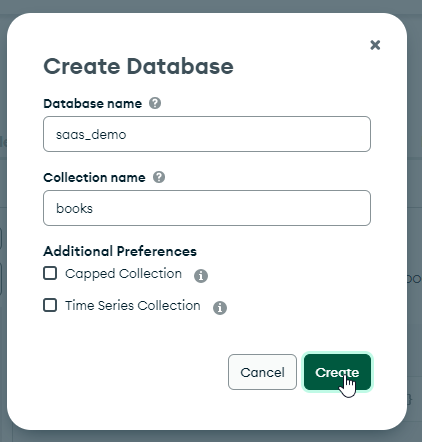
>
> We will add a new collection called 'publishers'. The second new collection will be automatically created
> when we trigger an event.
>
> 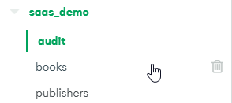
>
> The data for this collection is provided as a download, which you may then import into your demo database.
> ...

Login to your MongoDB Atlas Account

Open MongoAtlas (cloud.mongodb.com)

From the dashboard home page, locate and click on Triggers

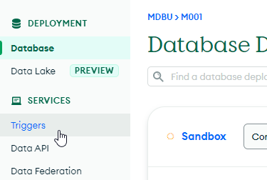.

Click Add Trigger to add a new Trigger

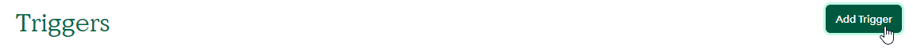

### Define the trigger

Give the trigger a name and enable it.

| Item               | Value                             | Image                                |
| ------------------ | --------------------------------- | ------------------------------------ |
| Trigger Type       | Database                          | 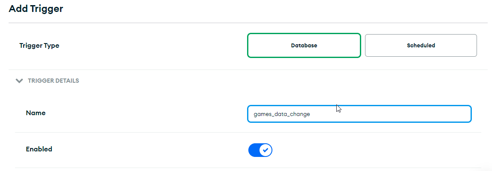 |
| Trigger Name       | publisher_data_change             |                                      |
| Enables            | ON                                |                                      |

Set the event ordering to ON, and the link data source will be the Sandbox for our example.

| Item               | Value                             | Image                                |
| ------------------ | --------------------------------- | ------------------------------------ |
| Event ordering     | ON                                | 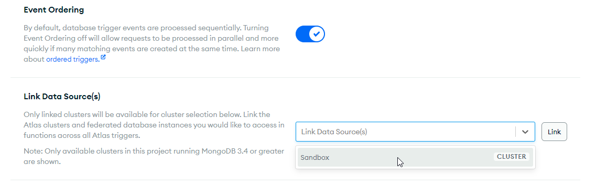 |
| Link data Source   | Sandbox                           | 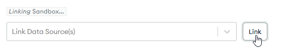 |

Next set the trigger source. This is the Cluster name, the database (saas_demo), the publishers collection
and teh operations will be all four - insert, update, delete and replace.

| Item               | Value                             | Image                                |
| ------------------ | --------------------------------- | ------------------------------------ |
| Cluster Name       | Sandbox                           | 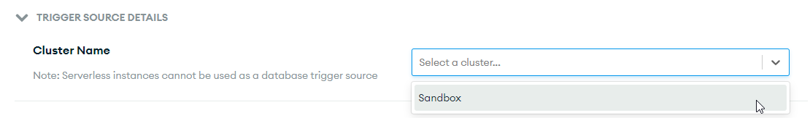 |
| Database Name      | saas_demo                         | 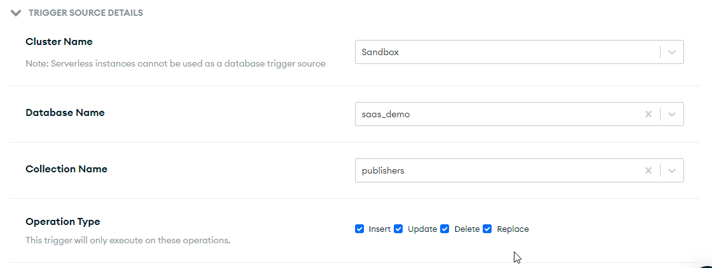 |
| Collection Name    | publishers                        |                                      |
| Operation Type     | Insert, Update, Replace, Delete   |                                      |

To track changes in the documents and to send their full details back via the change event, we 
turn on the Full Document option:

| Item               | Value                             | Image                                |
| ------------------ | --------------------------------- | ------------------------------------ |
| Full Document      | ON                                | 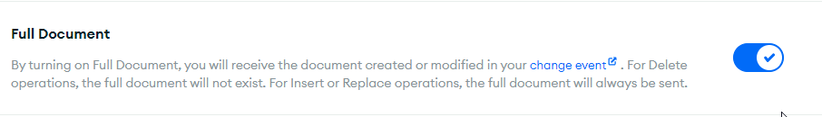 |

Next we add the function to be executed on document changes.

The function we will run is then written in JS:

```javascript
/* This uses PROMISES in place of async calls. */

exports = function(changeEvent) {
    /* Get the document from the change event */
    const newDocument = changeEvent.fullDocument;

    /* if we do not have a 'new document' then display an error to the console log */
    /* This could be modified to also check if there was a delete event, and log the event */
    if (!newDocument) {
        console.log('No document found in the change event');
        return;
    }

    /* Create the audit document - for the insert */
    const auditDocument = {
        eventType: 'insert',
        collectionName: 'publishers',
        documentId: newDocument._id,
        timestamp: new Date(),
        data: newDocument
    };

    /* connect to your Sandbox, then the demo_saas database, and the audit collection */
    const atlasClient = context.services.get("Sandbox");
    const auditCollection = atlasClient.db("saas_saas").collection("audit");

    /* return the result of inserting the audit document */
    return auditCollection.insertOne(auditDocument)
        .then(result => {
            console.log(`Inserted audit document with ID ${result.insertedId}`);
        })
        .catch(error => {
            console.error(error);
        });
};
```

In the Testing console we add the following code:

```javascript
const changeEvent = {
  operationType: 'insert',
  fullDocument: {
    "_id": {
      "$oid": "6068b0f198de9c13d56d79f7"
    },
    "name": "John Doe",
    "email": "johndoe@example.com",
    "created_at": {
      "$date": "2023-04-03T12:00:00.000Z"
    }
  }
};

exports(changeEvent);
```

This acts as a dummy test for the insert event.

You may then run the test and verify you get:

```text

> ran at Mon Apr 03 2023 16:01:27 GMT+0800 (Australian Western Standard Time)
> took undefined
> logs: 
Inserted audit document with ID 642a87da369562514369b89c
> result: 
{
  "$undefined": true
}
> result (JavaScript): 
EJSON.parse('{"$undefined":true}')
```

Here are the results from a test:

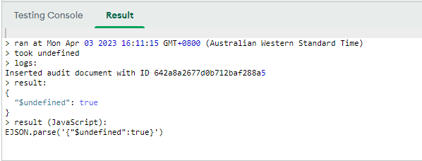

Now we can save the trigger.

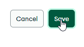

## Using the Trigger

Now to see if it works in practice.

Open the publishers collection and add a new publisher.

Once you have done this , open the audit collection and check the results.

You should see something like this:

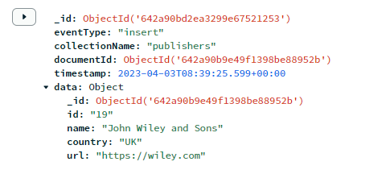

If you were to insert multiple new publishers using an array of new documents, then each new 
document would be tracked in the audit.

This is a wonderful way to keep tr5ack of changes in your system.

## Exercise

Add a trigger that logs deletions from the publisher collection. Test and then double check it
functions as expected when actually modifying the publisher collection by deleting one of the 
publishers you added.

## Exercise

Disable the delete trigger.

Modify the original trigger now log the deletions as well as insertions.

## Update/Replace

Finally, add suitable code that will log when a document is updated or replaced.

If it is possible, make sure you track these two changes separately.

### Warnings

When creating an audit type log, such as that shown, make sure that 
any data such as passwords, drivers-license details, eMail addresses, etc.,
are obfuscated/redacted/scrambled.